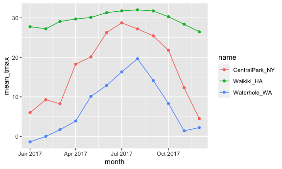

EDA - group by and summarize
================
Tanya Butt

``` r
library(tidyverse)
```

    ## ── Attaching packages ─────────────────────────────────────── tidyverse 1.3.1 ──

    ## ✓ ggplot2 3.3.5     ✓ purrr   0.3.4
    ## ✓ tibble  3.1.4     ✓ dplyr   1.0.7
    ## ✓ tidyr   1.1.3     ✓ stringr 1.4.0
    ## ✓ readr   2.0.1     ✓ forcats 0.5.1

    ## ── Conflicts ────────────────────────────────────────── tidyverse_conflicts() ──
    ## x dplyr::filter() masks stats::filter()
    ## x dplyr::lag()    masks stats::lag()

``` r
knitr::opts_chunk$set(
  fig.width = 6,
  fig.asp = .6, 
  out.width = "90%"
)
```

Load in a dataset that we’ll use often.

``` r
weather_df =  
  rnoaa::meteo_pull_monitors(
    c("USW00094728", "USC00519397", "USS0023B17S"),
    var = c("PRCP", "TMIN", "TMAX"), 
    date_min = "2017-01-01",
    date_max = "2017-12-31") %>%
  mutate(
    name = recode(
      id, 
      USW00094728 = "CentralPark_NY", 
      USC00519397 = "Waikiki_HA",
      USS0023B17S = "Waterhole_WA"),
    tmin = tmin / 10,
    tmax = tmax / 10,
    month = lubridate::floor_date(date, unit = "month")) %>%
  select(name, id, everything())
```

    ## Registered S3 method overwritten by 'hoardr':
    ##   method           from
    ##   print.cache_info httr

    ## using cached file: ~/Library/Caches/R/noaa_ghcnd/USW00094728.dly

    ## date created (size, mb): 2021-10-07 18:01:39 (7.604)

    ## file min/max dates: 1869-01-01 / 2021-10-31

    ## using cached file: ~/Library/Caches/R/noaa_ghcnd/USC00519397.dly

    ## date created (size, mb): 2021-10-07 18:01:43 (1.697)

    ## file min/max dates: 1965-01-01 / 2020-02-29

    ## using cached file: ~/Library/Caches/R/noaa_ghcnd/USS0023B17S.dly

    ## date created (size, mb): 2021-10-07 18:01:45 (0.912)

    ## file min/max dates: 1999-09-01 / 2021-09-30

## ‘group\_by’

``` r
weather_df %>% 
 group_by(name, month)
```

    ## # A tibble: 1,095 × 7
    ## # Groups:   name, month [36]
    ##    name           id          date        prcp  tmax  tmin month     
    ##    <chr>          <chr>       <date>     <dbl> <dbl> <dbl> <date>    
    ##  1 CentralPark_NY USW00094728 2017-01-01     0   8.9   4.4 2017-01-01
    ##  2 CentralPark_NY USW00094728 2017-01-02    53   5     2.8 2017-01-01
    ##  3 CentralPark_NY USW00094728 2017-01-03   147   6.1   3.9 2017-01-01
    ##  4 CentralPark_NY USW00094728 2017-01-04     0  11.1   1.1 2017-01-01
    ##  5 CentralPark_NY USW00094728 2017-01-05     0   1.1  -2.7 2017-01-01
    ##  6 CentralPark_NY USW00094728 2017-01-06    13   0.6  -3.8 2017-01-01
    ##  7 CentralPark_NY USW00094728 2017-01-07    81  -3.2  -6.6 2017-01-01
    ##  8 CentralPark_NY USW00094728 2017-01-08     0  -3.8  -8.8 2017-01-01
    ##  9 CentralPark_NY USW00094728 2017-01-09     0  -4.9  -9.9 2017-01-01
    ## 10 CentralPark_NY USW00094728 2017-01-10     0   7.8  -6   2017-01-01
    ## # … with 1,085 more rows

## count some things

``` r
weather_df %>% 
  group_by(month) %>% 
  summarize(n_obs = n())
```

    ## # A tibble: 12 × 2
    ##    month      n_obs
    ##    <date>     <int>
    ##  1 2017-01-01    93
    ##  2 2017-02-01    84
    ##  3 2017-03-01    93
    ##  4 2017-04-01    90
    ##  5 2017-05-01    93
    ##  6 2017-06-01    90
    ##  7 2017-07-01    93
    ##  8 2017-08-01    93
    ##  9 2017-09-01    90
    ## 10 2017-10-01    93
    ## 11 2017-11-01    90
    ## 12 2017-12-01    93

``` r
weather_df %>% 
  group_by(name, month) %>% 
  summarize(n_obs = n())
```

    ## `summarise()` has grouped output by 'name'. You can override using the `.groups` argument.

    ## # A tibble: 36 × 3
    ## # Groups:   name [3]
    ##    name           month      n_obs
    ##    <chr>          <date>     <int>
    ##  1 CentralPark_NY 2017-01-01    31
    ##  2 CentralPark_NY 2017-02-01    28
    ##  3 CentralPark_NY 2017-03-01    31
    ##  4 CentralPark_NY 2017-04-01    30
    ##  5 CentralPark_NY 2017-05-01    31
    ##  6 CentralPark_NY 2017-06-01    30
    ##  7 CentralPark_NY 2017-07-01    31
    ##  8 CentralPark_NY 2017-08-01    31
    ##  9 CentralPark_NY 2017-09-01    30
    ## 10 CentralPark_NY 2017-10-01    31
    ## # … with 26 more rows

``` r
weather_df %>% 
  count(name)
```

    ## # A tibble: 3 × 2
    ##   name               n
    ##   <chr>          <int>
    ## 1 CentralPark_NY   365
    ## 2 Waikiki_HA       365
    ## 3 Waterhole_WA     365

``` r
weather_df %>% 
  count(month, name = "n_obs")
```

    ## # A tibble: 12 × 2
    ##    month      n_obs
    ##    <date>     <int>
    ##  1 2017-01-01    93
    ##  2 2017-02-01    84
    ##  3 2017-03-01    93
    ##  4 2017-04-01    90
    ##  5 2017-05-01    93
    ##  6 2017-06-01    90
    ##  7 2017-07-01    93
    ##  8 2017-08-01    93
    ##  9 2017-09-01    90
    ## 10 2017-10-01    93
    ## 11 2017-11-01    90
    ## 12 2017-12-01    93

It’s nice that summarize produces a data frame. ‘table’ doesn’t do that,
and it’s bad.

``` r
weather_df %>% 
  pull(name) %>% 
  table()
```

    ## .
    ## CentralPark_NY     Waikiki_HA   Waterhole_WA 
    ##            365            365            365

``` r
weather_df %>% 
  janitor::tabyl(month, name)
```

    ##       month CentralPark_NY Waikiki_HA Waterhole_WA
    ##  2017-01-01             31         31           31
    ##  2017-02-01             28         28           28
    ##  2017-03-01             31         31           31
    ##  2017-04-01             30         30           30
    ##  2017-05-01             31         31           31
    ##  2017-06-01             30         30           30
    ##  2017-07-01             31         31           31
    ##  2017-08-01             31         31           31
    ##  2017-09-01             30         30           30
    ##  2017-10-01             31         31           31
    ##  2017-11-01             30         30           30
    ##  2017-12-01             31         31           31

## More general summaries

Let’s count, take means, look at SDs…

``` r
weather_df %>% 
  group_by(name, month) %>% 
  summarize(
    n_obs = n(),
    mean_tmax = mean(tmax, na.rm = TRUE),
    sd_tmax = sd(tmax, na.rm = TRUE)
  ) %>% 
  ggplot(aes(x = month, y = mean_tmax, color = name)) +
  geom_point() + 
  geom_line()
```

    ## `summarise()` has grouped output by 'name'. You can override using the `.groups` argument.



Formatting table outputs.

``` r
weather_df %>% 
  group_by(name) %>% 
  summarize(
    n_obs = n(),
    mean_tmax = mean(tmax, na.rm = TRUE)
  ) %>% 
  knitr::kable(digits = 2)
```

| name            | n\_obs | mean\_tmax |
|:----------------|-------:|-----------:|
| CentralPark\_NY |    365 |      17.37 |
| Waikiki\_HA     |    365 |      29.66 |
| Waterhole\_WA   |    365 |       7.48 |

## grouped ‘mutate’

``` r
weather_df %>% 
  group_by(name) %>% 
  mutate(
    mean_tmax = mean(tmax, na.rm = TRUE),
    centered_tmax = tmax - mean_tmax) %>% 
  ggplot(aes(x = date, y = centered_tmax, color = name)) +
  geom_point()
```

    ## Warning: Removed 3 rows containing missing values (geom_point).


``` r
weather_df %>% 
  group_by(name) %>% 
  mutate(
    tmax_rank = min_rank(desc(tmax))
  ) %>% 
  filter(tmax_rank < 2)
```

    ## # A tibble: 4 × 8
    ## # Groups:   name [3]
    ##   name           id          date        prcp  tmax  tmin month      tmax_rank
    ##   <chr>          <chr>       <date>     <dbl> <dbl> <dbl> <date>         <int>
    ## 1 CentralPark_NY USW00094728 2017-06-13     0  34.4  25   2017-06-01         1
    ## 2 CentralPark_NY USW00094728 2017-07-20     3  34.4  25   2017-07-01         1
    ## 3 Waikiki_HA     USC00519397 2017-07-12     0  33.3  24.4 2017-07-01         1
    ## 4 Waterhole_WA   USS0023B17S 2017-08-03     0  26.4  13.3 2017-08-01         1

``` r
weather_df %>% 
  group_by(month) %>% 
  summarize(
    n_obs = n(),
    n_days = n_distinct(date))
```

    ## # A tibble: 12 × 3
    ##    month      n_obs n_days
    ##    <date>     <int>  <int>
    ##  1 2017-01-01    93     31
    ##  2 2017-02-01    84     28
    ##  3 2017-03-01    93     31
    ##  4 2017-04-01    90     30
    ##  5 2017-05-01    93     31
    ##  6 2017-06-01    90     30
    ##  7 2017-07-01    93     31
    ##  8 2017-08-01    93     31
    ##  9 2017-09-01    90     30
    ## 10 2017-10-01    93     31
    ## 11 2017-11-01    90     30
    ## 12 2017-12-01    93     31

``` r
weather_df %>% 
  mutate(
    cold = case_when(
      tmax < 5 ~ "cold",
      tmax >= 5 ~ "not_cold",
      TRUE ~ ""
    )) %>% 
  filter(name != "Waikiki_HA") %>% 
  group_by(name, cold) %>% 
  summarize(count = n())
```

    ## `summarise()` has grouped output by 'name'. You can override using the `.groups` argument.

    ## # A tibble: 4 × 3
    ## # Groups:   name [2]
    ##   name           cold     count
    ##   <chr>          <chr>    <int>
    ## 1 CentralPark_NY cold        44
    ## 2 CentralPark_NY not_cold   321
    ## 3 Waterhole_WA   cold       172
    ## 4 Waterhole_WA   not_cold   193

``` r
weather_df %>% 
  mutate(cold = case_when(
    tmax < 5 ~ "cold",
    tmax >= 5 ~ "not_cold",
    TRUE      ~ ""
  )) %>% 
  filter(name != "Waikiki_HA") %>% 
  janitor::tabyl(name, cold)
```

    ##            name cold not_cold
    ##  CentralPark_NY   44      321
    ##    Waterhole_WA  172      193

Lagged Variables

``` r
#what's the lag information from the day before
weather_df %>% 
  group_by(name) %>% 
  mutate(
    lagged_tmax = lag(tmax, n = 1),
    tmax_diff = tmax - lagged_tmax
  ) %>% 
  summarize(diff_sd = sd(tmax_diff, na.rm = TRUE))
```

    ## # A tibble: 3 × 2
    ##   name           diff_sd
    ##   <chr>            <dbl>
    ## 1 CentralPark_NY    4.45
    ## 2 Waikiki_HA        1.23
    ## 3 Waterhole_WA      3.13

## Limitations

What if my “summary” is a linear model…

Well…that doesn’t work

``` r
weather_df %>% 
  group_by(name) %>% 
  summarize(cor_tmin_tmax = cor(tmin, tmax, use = "complete"))
```

    ## # A tibble: 3 × 2
    ##   name           cor_tmin_tmax
    ##   <chr>                  <dbl>
    ## 1 CentralPark_NY         0.955
    ## 2 Waikiki_HA             0.638
    ## 3 Waterhole_WA           0.939

``` r
weather_df %>% 
  filter(name == "CentralPark_NY") %>% 
  lm(tmax ~ tmin, data = .)
```

    ## 
    ## Call:
    ## lm(formula = tmax ~ tmin, data = .)
    ## 
    ## Coefficients:
    ## (Intercept)         tmin  
    ##       7.209        1.039

## general summaries

``` r
weather_df %>% 
  group_by(month) %>% 
  summarize(
    mean_tmax = mean(tmax),
    mean_prec = mean(prcp, na.rm = TRUE),
    median_tmax = median(tmax),
    sd_tmax = sd(tmax))
```

    ## # A tibble: 12 × 5
    ##    month      mean_tmax mean_prec median_tmax sd_tmax
    ##    <date>         <dbl>     <dbl>       <dbl>   <dbl>
    ##  1 2017-01-01      10.8     37.0          6.1   13.1 
    ##  2 2017-02-01      12.2     57.9          8.3   12.1 
    ##  3 2017-03-01      13.0     54.6          8.3   12.4 
    ##  4 2017-04-01      17.3     32.9         18.3   11.2 
    ##  5 2017-05-01      NA       28.4         NA     NA   
    ##  6 2017-06-01      23.5     18.7         27.2    8.73
    ##  7 2017-07-01      NA       12.7         NA     NA   
    ##  8 2017-08-01      26.3     10.2         27.2    5.87
    ##  9 2017-09-01      23.8      9.94        26.1    8.42
    ## 10 2017-10-01      20.1     41.5         22.2    9.75
    ## 11 2017-11-01      14.0     61.5         12.0   11.6 
    ## 12 2017-12-01      11.0     40.2          8.9   11.9

``` r
weather_df %>% 
  group_by(name, month) %>% 
  summarize(
    mean_tmax = mean(tmax),
    median_tmax = median(tmax))
```

    ## `summarise()` has grouped output by 'name'. You can override using the `.groups` argument.

    ## # A tibble: 36 × 4
    ## # Groups:   name [3]
    ##    name           month      mean_tmax median_tmax
    ##    <chr>          <date>         <dbl>       <dbl>
    ##  1 CentralPark_NY 2017-01-01      5.98         6.1
    ##  2 CentralPark_NY 2017-02-01      9.28         8.3
    ##  3 CentralPark_NY 2017-03-01      8.22         8.3
    ##  4 CentralPark_NY 2017-04-01     18.3         18.3
    ##  5 CentralPark_NY 2017-05-01     20.1         19.4
    ##  6 CentralPark_NY 2017-06-01     26.3         27.2
    ##  7 CentralPark_NY 2017-07-01     28.7         29.4
    ##  8 CentralPark_NY 2017-08-01     27.2         27.2
    ##  9 CentralPark_NY 2017-09-01     25.4         26.1
    ## 10 CentralPark_NY 2017-10-01     21.8         22.2
    ## # … with 26 more rows

``` r
weather_df %>% 
  group_by(name, month) %>% 
  summarize(across(tmin:prcp, mean))
```

    ## `summarise()` has grouped output by 'name'. You can override using the `.groups` argument.

    ## # A tibble: 36 × 5
    ## # Groups:   name [3]
    ##    name           month        tmin  tmax  prcp
    ##    <chr>          <date>      <dbl> <dbl> <dbl>
    ##  1 CentralPark_NY 2017-01-01  0.748  5.98  39.5
    ##  2 CentralPark_NY 2017-02-01  1.45   9.28  22.5
    ##  3 CentralPark_NY 2017-03-01 -0.177  8.22  43.0
    ##  4 CentralPark_NY 2017-04-01  9.66  18.3   32.5
    ##  5 CentralPark_NY 2017-05-01 12.2   20.1   52.3
    ##  6 CentralPark_NY 2017-06-01 18.2   26.3   40.4
    ##  7 CentralPark_NY 2017-07-01 21.0   28.7   34.3
    ##  8 CentralPark_NY 2017-08-01 19.5   27.2   27.4
    ##  9 CentralPark_NY 2017-09-01 17.4   25.4   17.0
    ## 10 CentralPark_NY 2017-10-01 13.9   21.8   34.3
    ## # … with 26 more rows

``` r
weather_df %>% 
  group_by(name, month) %>% 
  summarize(mean_tmax = mean(tmax)) %>% 
  ggplot(aes(x = month, y = mean_tmax, color = name)) +
  geom_point() + geom_line() +
  theme(legend.position = "bottom")
```

    ## `summarise()` has grouped output by 'name'. You can override using the `.groups` argument.

    ## Warning: Removed 2 rows containing missing values (geom_point).


``` r
weather_df %>% 
  group_by(name, month) %>% 
  summarize(mean_tmax = mean(tmax)) %>% 
  pivot_wider(
    names_from = name,
    values_from = mean_tmax) %>% 
  knitr::kable(digits = 1)
```

    ## `summarise()` has grouped output by 'name'. You can override using the `.groups` argument.

| month      | CentralPark\_NY | Waikiki\_HA | Waterhole\_WA |
|:-----------|----------------:|------------:|--------------:|
| 2017-01-01 |             6.0 |        27.8 |          -1.4 |
| 2017-02-01 |             9.3 |        27.2 |           0.0 |
| 2017-03-01 |             8.2 |        29.1 |           1.7 |
| 2017-04-01 |            18.3 |        29.7 |           3.9 |
| 2017-05-01 |            20.1 |          NA |          10.1 |
| 2017-06-01 |            26.3 |        31.3 |          12.9 |
| 2017-07-01 |            28.7 |          NA |          16.3 |
| 2017-08-01 |            27.2 |        32.0 |          19.6 |
| 2017-09-01 |            25.4 |        31.7 |          14.2 |
| 2017-10-01 |            21.8 |        30.3 |           8.3 |
| 2017-11-01 |            12.3 |        28.4 |           1.4 |
| 2017-12-01 |             4.5 |        26.5 |           2.2 |

## Grouped mutate

``` r
weather_df %>% 
  group_by(name) %>% 
  mutate
```

    ## # A tibble: 1,095 × 7
    ## # Groups:   name [3]
    ##    name           id          date        prcp  tmax  tmin month     
    ##    <chr>          <chr>       <date>     <dbl> <dbl> <dbl> <date>    
    ##  1 CentralPark_NY USW00094728 2017-01-01     0   8.9   4.4 2017-01-01
    ##  2 CentralPark_NY USW00094728 2017-01-02    53   5     2.8 2017-01-01
    ##  3 CentralPark_NY USW00094728 2017-01-03   147   6.1   3.9 2017-01-01
    ##  4 CentralPark_NY USW00094728 2017-01-04     0  11.1   1.1 2017-01-01
    ##  5 CentralPark_NY USW00094728 2017-01-05     0   1.1  -2.7 2017-01-01
    ##  6 CentralPark_NY USW00094728 2017-01-06    13   0.6  -3.8 2017-01-01
    ##  7 CentralPark_NY USW00094728 2017-01-07    81  -3.2  -6.6 2017-01-01
    ##  8 CentralPark_NY USW00094728 2017-01-08     0  -3.8  -8.8 2017-01-01
    ##  9 CentralPark_NY USW00094728 2017-01-09     0  -4.9  -9.9 2017-01-01
    ## 10 CentralPark_NY USW00094728 2017-01-10     0   7.8  -6   2017-01-01
    ## # … with 1,085 more rows
